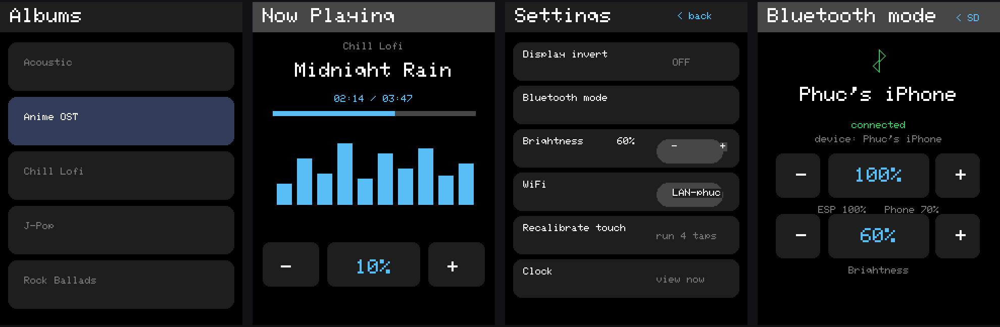

# CYD Album Player — ESP32 MP3/WAV Player + Bluetooth Speaker

Firmware cho board **ESP32-2432S028R (CYD — 3.2" touch)** biến nó thành:

- 🎵 **SD-mode**: trình phát MP3/WAV từ thẻ nhớ, giao diện album cảm ứng, visualizer, đồng hồ chờ
- 🔊 **Bluetooth-mode**: loa A2DP receiver — điện thoại / PC kết nối `CYD-32-BP` và phát nhạc ra loa qua amp **MAX98357A**

Hai chế độ **tách hoàn toàn**: chuyển mode = máy tự khởi động lại sạch vào đúng mode
(thiết kế cho board không PSRAM — 2 stack nặng không chạy chung một lần boot).



*(trái → phải: Album browser · Now Playing · Settings · Bluetooth mode)*

---

## Tính năng

### SD mode (mặc định khi boot)
- Đọc nhạc từ `/music/<album>/…` trên thẻ SD, duyệt album → bài hát cảm ứng
- Phát MP3 / WAV, auto-advance sang bài kế, tạm dừng / bài trước / bài sau
- Spectrum visualizer trên màn ST7789V, thanh progress + thời lượng thật (parse header MP3/Xing)
- **Đồng hồ chờ**: boot xong hiện clock, chạm để vào nhạc; idle 5 phút tự về clock
- Âm lượng 0–100% với nấc nhỏ 5-4-3-2-1 (mặc định mỗi lần boot SD = 10%), lưu NVS
- **Display invert** (nút INV + mục Settings) — NVS nhớ, boot tự áp dụng
- Chỉnh độ sáng màn hình (PWM backlight)
- **Boot WiFi tự động**: luôn thử mạng đã lưu → đồng bộ giờ + timezone (+07) → **tự tắt radio** ngay; không có mạng thì mở màn hình quét WiFi để chọn/nhập

### Bluetooth mode (Settings → "Bluetooth mode")
- Lưu cờ + **tự reset** vào chế độ loa thuần: không SD, không WiFi — radio 2.4 GHz chỉ cho Bluetooth
- A2DP **SBC sink**, tên thiết bị `CYD-32-BP` (ghép cặp từ điện thoại / PC / iPhone)
- Màn hình trạng thái: tên thiết bị kết nối, `connected`
- **2 volume độc lập** như loa BT thương mại:
  - Tăng/giảm trên **điện thoại** → stream scale theo phone, ESP giữ nguyên mức của nó
  - Nút **− / +** trên **màn CYD** → chỉnh gain của ESP (mặc định boot BT = 100%)
  - Màn hình hiển thị `ESP xx%  Phone xx%` realtime
- Hàng **Brightness** riêng trên màn BT
- Nút **`< SD`** (góc phải trên) → lưu cờ + reset về SD mode
- Audio PCM đổ ra **task I2S riêng pinned core 0** + ring buffer 8192 frame → không drop, không giật

### Jingle (âm báo) — boot / kết nối / ngắt kết nối
- 4 thời điểm có âm: **boot SD mode**, **boot BT mode**, **phone kết nối**, **phone ngắt kết nối**
- Mức âm **cố định 20%**, độc lập với volume đang lưu (SD boot mặc định 10% vẫn nghe rõ); không đổi gain thật của máy
- Nguồn âm theo thứ tự ưu tiên:
  1. Thẻ SD: `/sounds/boot.wav`, `/sounds/connect.wav`, `/sounds/disconnect.wav` — WAV PCM 8/16-bit, mono hoặc stereo, tần số bất kỳ ≤ 96 kHz, tối đa 6 giây (tự resample về 44.1 kHz). Có file trên thẻ thì firmware dùng file → đổi tiếng **không cần nạp lại**
  2. **PCM nhúng sẵn trong flash** (`cyd-album-v2/jingles_pcm.h`, sinh bằng `tools/make_jingles.py`) — bản build hiện tại đã nhúng 3 tiếng của anh, nên **không cần thẻ SD vẫn có âm báo**
  3. Không có cả hai → chime chuông sin dựng sẵn trong code
- An toàn: callback Bluetooth chỉ **set cờ**, âm thanh do task I2S core 0 phát (không gọi I2S trong callback → tránh watchdog); sau mỗi jingle, buffer nhạc từ điện thoại bị xoá để không phát lại đoạn cũ

### Kiến trúc chống crash (board không PSRAM)
- BT stack **chỉ start đúng một lần đời boot** — không `end()`/restart runtime (restart sink là nguyên nhân crash khi phone kết nối)
- Callback A2DP **không đụng I2S/LCD**: chỉ ghi PCM vào ring, mọi thao tác TFT chạy trên main loop
- `A2DP_SPP_SUPPORT 0` tiết kiệm RAM; WiFi tắt hẳn trước khi vào BT (chung radio)

---

## Phần cứng

| Linh kiện | Ghi chú |
|---|---|
| Board | ESP32-2432S028R (CYD) — **bản ST7789V**, dual-USB, **không PSRAM**, flash 4 MB |
| Màn | 3.2" 240×320 ST7789V + cảm ứng XPT2046 |
| Amp | **MAX98357A I2S 3W** (BCLK 22, LRC 27, DIN 17) |
| Loa | 4–8 Ω 2–3 W gắn vào clamp amp |
| SD | microSD (FAT32), layout `/music/<album>/*.mp3` |

> ⚠️ **GPIO17** vừa là I2S **DOUT** vừa là chân LED RGB (kênh B). Firmware không đụng RGB LED — nếu bạn thêm code LED hãy nhớ xung đột này.
> ⚠️ Một số lô CYD dùng màn **ILI9341** thay vì ST7789V. Firmware này cấu hình cho **ST7789V** (`Setup200_CYD_ESP32_2432S028R.h`). Nếu màn ILI9341, đổi setup TFT_eSPI tương ứng và kiểm tra rotation.

## Pin map

```
TFT:   MISO 12 | MOSI 13 | SCLK 14 | CS 15 | DC 2 | BL 21 (PWM) | RST 33*
Touch: CS 33  | CLK 25  | MOSI 32 | MISO 39 | IRQ 36   (HSPI)
SD:    CS 5   | MOSI 23 | MISO 19 | SCLK 18             (VSPI)
I2S:   BCLK 22| LRC 27  | DIN 17  (-> MAX98357A)
(*RST dùng chung chân với touch CS trên một số bản CYD — không nối nếu đã dùng touch)
```

---

## Môi trường phát triển & cấu hình thư viện

- **Arduino CLI** (hoặc IDE 2.x) + board package **esp32 by Espressif ≥ 3.3.x**
- Thư viện ( installs qua Library Manager / git):

| Thư viện | Bản | Vai trò |
|---|---|---|
| TFT_eSPI | ≥ 2.5 | Màn ST7789V + touch driver XPT2046 (bundled) |
| ESP8266Audio (fork earlephilhower) | ≥ 2.4 | Decode MP3/WAV, `AudioOutputI2S` (IDF5) |
| **ESP32-A2DP** (pschatzmann) | ≥ 1.8 | A2DP Sink Bluetooth |
| Preferences / WiFi / SD (core) | — | NVS, đồng bộ giờ, đọc thẻ |

### Bước quan trọng nhất: cấu hình TFT_eSPI
Mở `User_Setup_Select.h` trong thư viện TFT_eSPI
(tìm bằng `arduino-cli config dump | grep sketchbook` → `<sketchbook>/libraries/TFT_eSPI/`):

```cpp
#include <User_Setups/Setup200_CYD_ESP32_2432S028R.h>   // bật dòng này
//#include <User_Setup.h>                                 // Giữ nguyên COMMENT
```

File `Setup200_CYD_ESP32_2432S028R.h` phải có `ST7789_DRIVER` + `TFT_RGB_ORDER TFT_BGR` —
thiếu BGR sẽ bị **đảo màu đỏ/xanh** (vàng hiện xanh). Firmware này rotation mặc định `0`.

---

## Nạp firmware

### Yêu cầu
- **Partition `huge_app`** (app 3 MB) — firmware 1.87 MB không nhét vừa partition default 1.25 MB
- Nạp nguyên khối (bootloader + partition table + app) tại `0x0`

### Cách 1 — Web flasher có sẵn trong repo (`tools/esp-flasher/`)
Launcher Web Serial (esptool-js) — **Chrome / Edge**, không cần cài gì:

```bash
cd tools/esp-flasher
python3 server.py            # mở http://127.0.0.1:9121 (thêm --build để compile trước)
# hoặc mở trực tiếp index.html (Chrome, cần flag --allow-file-access-from-files)
```

1. Bấm **Build** (nếu có server) → firmware compile ra `firmware/cyd-album-v2/` với 4 ảnh + `manifest.json`
2. Cắm CYD bằng cáp USB, chọn port, bấm **Flash** → launcher tự nạp đúng offset:

| Ảnh | Địa chỉ |
|---|---|
| `bootloader.bin` | `0x1000` |
| `partitions.bin` | `0x8000` |
| `boot_app0.bin` | `0xE000` |
| `app.bin` | `0x10000` |

> ⚠️ Sau khi **đổi partition scheme** phải nạp **đủ 4 vùng** — chỉ nạp `app.bin` cũ sẽ treo.
> Không tự tin? Nạp ảnh gộp 1 file tại `0x0` (xem Cách 2).

### Cách 2 — esptool CLI

```bash
esptool.py --chip esp32 --port /dev/ttyUSB0 -b 921600 write_flash 0x0 cyd-album-v2-merged.bin
```

Merged bin sinh bằng: `./build.sh` → `tools/esp-flasher/firmware/cyd-album-v2/`
hoặc `arduino-cli compile --fqbn esp32:esp32:esp32:PartitionScheme=huge_app --output-dir out/` → `out/cyd-album-v2.ino.merged.bin`.

### Build thủ công (CLI)
```bash
arduino-cli compile --fqbn esp32:esp32:esp32:PartitionScheme=huge_app cyd-album-v2
```

---

## Sử dụng

**Thẻ nhạc:** chép vào `SD:/music/<tên-album>/baihat.mp3` (hỗ trợ `.mp3`, `.wav`).

**Thẻ âm báo (tuỳ chọn):** `SD:/sounds/boot.wav`, `SD:/sounds/connect.wav`, `SD:/sounds/disconnect.wav` — có thì firmware dùng file, không có thì dùng chime dựng sẵn.

**Thứ tự boot (SD mode):** loading → thử WiFi & đồng bộ giờ (tự tắt radio) → **đồng hồ chờ** → chạm để vào **Albums**.

**Vào Bluetooth:** `Settings → Bluetooth mode` → máy reset ~5 s → ra màn `CYD-32-BP waiting` → điện thoại mở Bluetooth ghép cặp → phát nhạc. Âm lượng chỉnh thoải mái trên phone hoặc nút trên màn CYD (2 mức hoạt động độc lập).

**Về SD:** chạm `"< SD"` góc phải trên → máy reset về trình phát nhạc.

**Cảm ứng lệch:** `Settings → Recalibrate touch` → chạm 4 điểm.

---

## Ghi công / Bắt nguồn từ

Giao diện (bố cục màn hình, bảng màu dark, browser/player/settings, cảm ứng, visualizer)
**mượn hoàn toàn** từ dự án **[malaq88/CYDAlbumPlayer](https://github.com/malaq88/CYDAlbumPlayer)** —
chân thành cảm ơn tác giả.

Bản port/cá nhân hoá của tôi thay đổi:
- 🗑️ **Bỏ toàn bộ BLE** của bản gốc → thêm **A2DP Bluetooth Speaker mode** (chiều ngược lại: điện thoại phát vào CYD, dùng [ESP32-A2DP](https://github.com/pschatzmann/ESP32-A2DP) của pschatzmann)
- 🏗️ **Dual-mode kiến trúc reset-clean**: SD/BT không bao giờ sống chung một boot — chống crash trên board không PSRAM
- 🔊 Đường audio **I2S → MAX98357A** (thay vì BT-external như bản gốc) + BT audio task riêng core 0 chống drop
- ⏰ **Đồng hồ chờ** + NTP timezone +07 + boot WiFi sync xong **tự tắt radio**
- 🎚️ Volume nấc nhỏ (5-4-3-2-1), 2 volume độc lập SD/BT, nút INV đảo màu, brightness, 4-point touch calibration
- 🛠️ **Web flasher launcher** (`tools/esp-flasher`) nạp tự động 4 vùng qua trình duyệt

Repo của malaq88 **không kèm license** — phần UI/ý tưởng gốc thuộc tác giả đó, hãy tôn trọng khi lấy cảm hứng. Phần code chỉnh sửa/port của tôi trong repo này dùng cho mục đích học tập/cá nhân; nếu bạn có kế hoạch thương mại, hãy liên hệ tác giả gốc.

## Cấu trúc repo

```
cyd-album-v2/
  cyd-album-v2.ino      # firmware chính (~2.6k dòng)
  README.md
  docs-screens.png      # ảnh UI 4 màn
build.sh                # compile + đóng gói 4 vùng vào esp-flasher
tools/esp-flasher/      # web flasher (esptool-js) — chạy `python3 server.py`
```

## License

Không khai báo license chính thức. Tôn trọng phần gốc của malaq88/CYDAlbumPlayer (không license) như ghi chú ở mục **Ghi công**.
